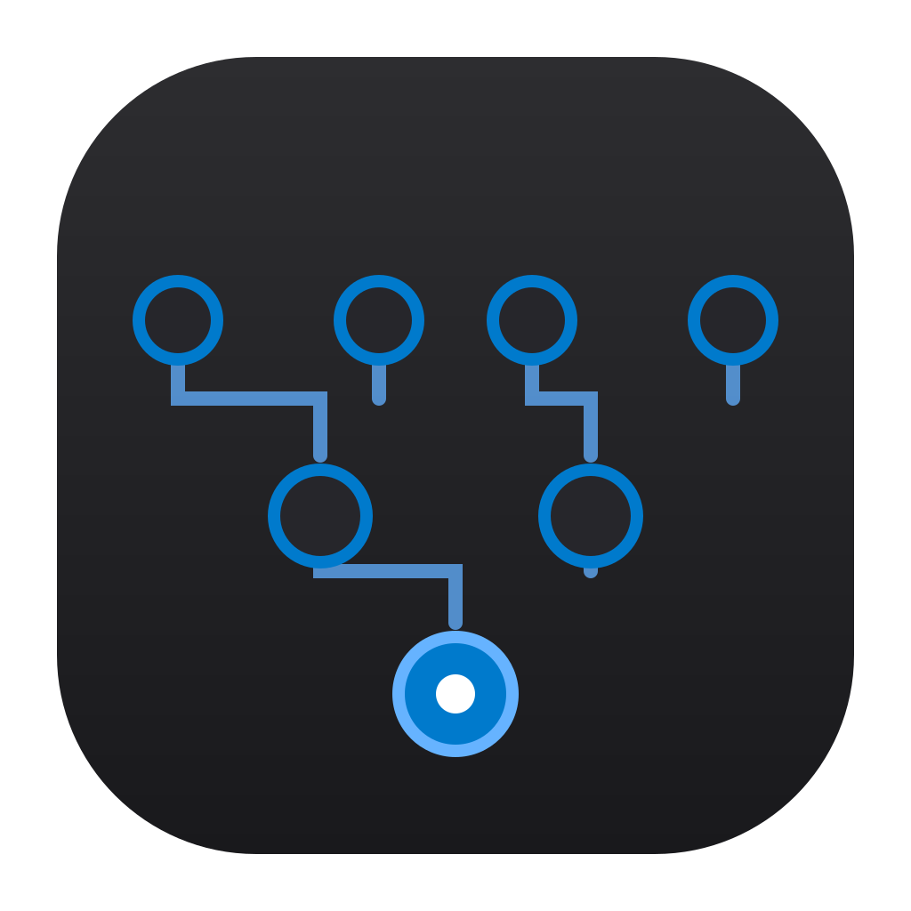
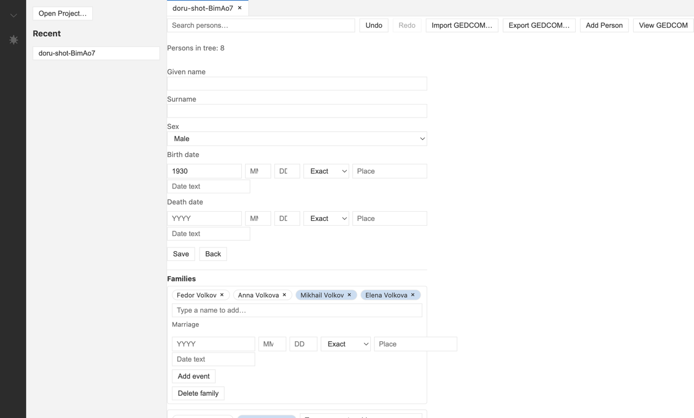

<p align="center">
  
</p>

<h1 align="center">Dóru</h1>

<p align="center"><strong>Local-first genealogy for the AI era.</strong></p>

<p align="center">
  <a href="https://github.com/borisovodov/doru/releases/latest"></a>
  <a href="https://github.com/borisovodov/doru/actions/workflows/ci.yml"></a>
  <a href="https://github.com/borisovodov/doru/releases"></a>
  <a href="LICENSE.md"></a>
  <a href="https://doru.ovodov.me"></a>
</p>

A cross-platform desktop app for working with family trees: your data stays in
plain folders on your disk, works fully offline, and is designed to be driven
by AI agents through MCP and chat.

The name comes from Proto-Indo-European _\*dóru_ — “tree”.



## Highlights

- **Local-first.** A project is a plain folder containing a `tree.doru` SQLite
  database, text-based `settings.json` and `theme.css`, and a `history.jsonl`
  audit log. Nothing is hidden; everything is editable by hand or by agents.
- **AI-native.** Dóru is both an MCP server — run `doru --mcp-server <project>`
  and any MCP client (Claude Desktop, Cursor) can query and edit your tree
  through `tree_query`, `tree_edit`, `sources_add`, `notes_write`,
  `charts_render` — and an agent chat built into the UI: provider presets
  (OpenAI, Anthropic, Gemini, OpenRouter, Ollama, LM Studio, custom
  endpoints) configured in the in-app settings with keys stored in the OS
  keychain, external MCP servers, and ACP agents.
- **Auditable.** Every mutation is recorded with its actor — user or agent
  (`agent:{host}/{model}#{promptHash}`). AI edits are always reviewable and
  gated by permission prompts.
- **Workbench-style UI.** Activity bar, sidebar, tabs, editor area, panel,
  command palette, themes as text files, text-based configuration, codicons.

## Features

### Genealogy

- **Persons** — the full list with live search; each person card holds names,
  sex, and birth/death dates with a quality marker (*exact / about / before /
  after*) plus a free-text form for dates that do not map to Gregorian.
- **Families** — add parents, partners, and children from a person card;
  chips show the members of each family, and removing someone from a family
  is one click.
- **Sources and notes** — attach a source (title and author) as a citation or
  reuse an existing one; keep free-form research notes on any person.
- **Undo/redo** — every change, including whole GEDCOM imports and edits made
  by agents, can be undone (`Cmd+Z` / `Shift+Cmd+Z`, Ctrl on Windows/Linux).

### Import and export

- **GEDCOM 5.5 / 5.5.1 import**, **GEDCOM 7.0 export**, and a read-only
  GEDCOM view of the whole tree.
- **Tabs** — several projects open side by side; recent projects are listed
  in the sidebar, open tabs are restored on launch, and `doru://open?path=…`
  links or double-clicked `*.doru` files open in the running app.

### AI and agents

- **In-app chat** — the agent reads and edits the tree with built-in tools:
  `tree_query`, `tree_get`, `tree_stats`, `tree_edit`, `sources_add`,
  `notes_write`, `charts_render`.
- **Any provider** — presets for OpenAI, Anthropic, Gemini, OpenRouter,
  Ollama, LM Studio, and custom OpenAI-compatible endpoints; API keys are
  stored encrypted in the OS keychain.
- **Permission prompts** — read-only tools run freely; mutating tools and
  external MCP tools ask for confirmation inline.
- **MCP server mode** — run `doru --mcp-server <project>` and any MCP client
  (Claude Desktop, Cursor) can query and edit your tree; the in-app agent can
  also use tools from external MCP servers, and ACP agents are supported.

### Configuration and themes

- **`doru.json`** — plain JSON with comments, edited in any editor, picked up
  live while the app runs.
- **`theme.css`** — the interface is styled through CSS custom properties;
  save the file and the app restyles immediately.
- **17 languages** — the UI always follows the operating system language.

## Installation

Download the installer for your platform from the
[releases page](https://github.com/borisovodov/doru/releases/latest):

| Platform | Installer |
|---|---|
| macOS (Apple Silicon) | `doru-mac-arm64.dmg` |
| Windows (x64) | `doru-windows-x64.exe` |
| Windows (arm64) | `doru-windows-arm64.exe` |
| Linux (x64) | `doru-linux-x86_64.AppImage` or `doru-linux-amd64.deb` |
| Linux (arm64) | `doru-linux-arm64.AppImage` or `doru-linux-arm64.deb` |

macOS builds are signed and notarized. Windows builds are not code-signed yet,
so SmartScreen may show a warning — click “More info → Run anyway”. On Linux,
the `.deb` installs with `sudo apt install ./doru-*.deb`; the AppImage needs
`chmod +x` and then just runs. See the
[User Guide](https://doru.ovodov.me/guide/user-guide) for details.

## Documentation

See the [User Guide](https://doru.ovodov.me/guide/user-guide) for installation,
tree editing, AI agents, themes, and troubleshooting.

## Development

Requirements: Node.js >= 22.13 (built-in `node:sqlite`) and npm.

```sh
npm install
npm run dev          # run the desktop app in dev mode
npm test             # unit tests (vitest)
npm run typecheck    # strict TypeScript across all workspaces
npm run build        # production build (electron-vite)
npm run e2e          # Playwright smoke test against the built app
npm run site:dev     # the VitePress website
```
